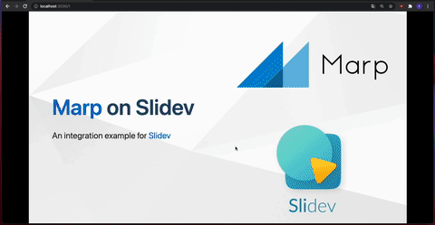

# poc-marp-slidev

Just a curious and crazy PoC to integrate [Marp](https://marp.app) with [Slidev](https://sli.dev). Render Marp slides on Slidev's presentation interface.

**[https://poc-marp-slidev.netlify.app/](https://poc-marp-slidev.netlify.app/)**

<p align="center">
  <a href="https://poc-marp-slidev.netlify.app/"></a>
</p>

## Try

```
npm i
npm run dev
```

## Is it useful?

This PoC may be helpful if you like simple and minimum Markdown syntax provided by Marp, and want more enhanced presentation interface from Slidev: Overview, Recording, Drawing, Webcam PiP, etc...

## License

[WTFPL](./LICENSE)
